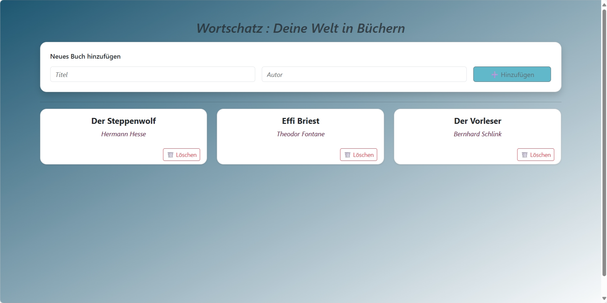
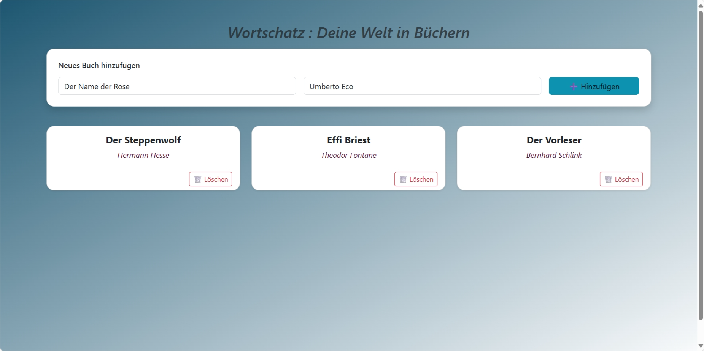
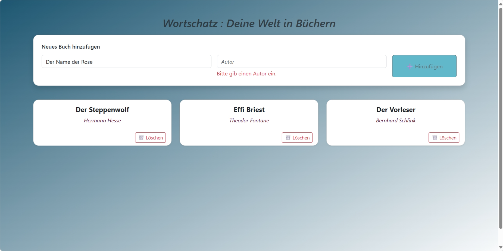
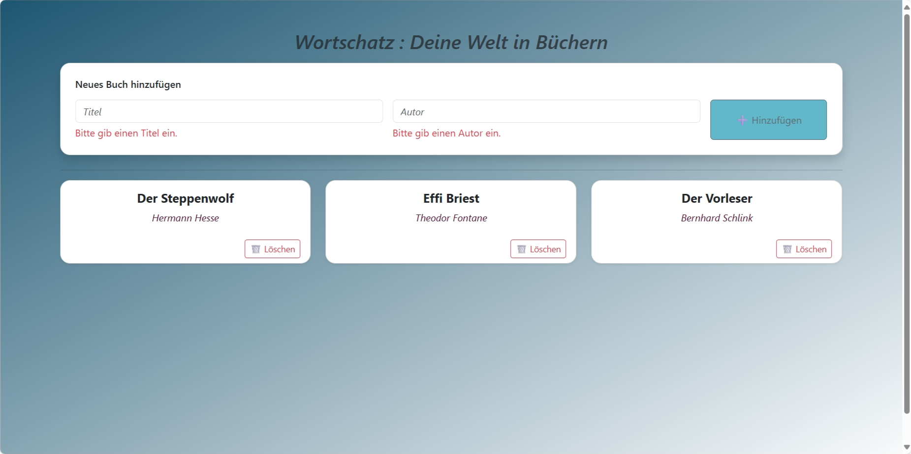
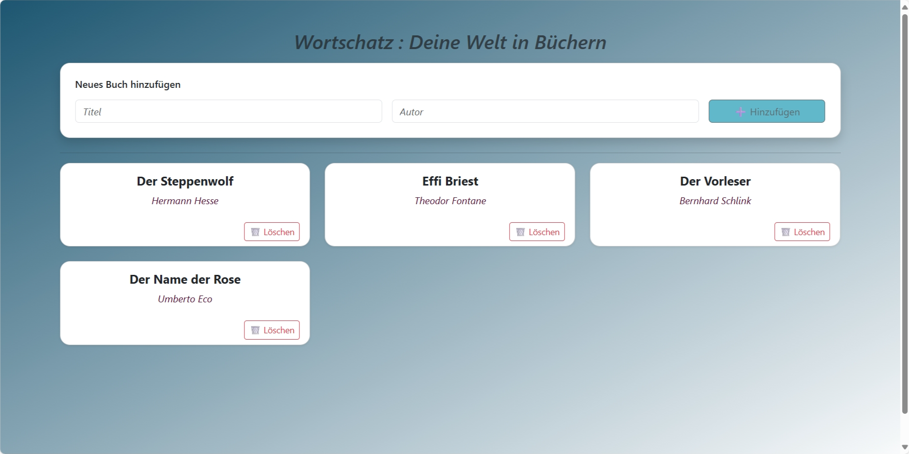

Semesteraufgabe WebTech – Bücher-App

Diese Anwendung wurde im Rahmen des Moduls Webtechnologien entwickelt. Ziel war es, eine vollständige Fullstack-Anwendung umzusetzen, bestehend aus einem Angular-Frontend, einem Node.js-Backend und einer PostgreSQL-Datenbank.

Die Anwendung ermöglicht es, Bücher zu verwalten. Es ist möglich, neue Bücher anzulegen, alle vorhandenen Bücher anzuzeigen und einzelne Bücher zu löschen. 

Die Anwendung ist in zwei Hauptteile gegliedert: das Frontend befindet sich im Ordner "buecher-app", das Backend im Ordner "backend". Zusätzlich enthält das Projektverzeichnis einen Ordner "Screenshots" mit Abbildungen zur Anwendung sowie diese README-Datei und die .gitignore.

Verzeichnisstruktur:

Im Projektverzeichnis befinden sich folgende Ordner und Dateien:

Semesteraufgabe Webtech/
│
├── buecher-app/                → Angular-Frontend
│   ├── seiten/                → Enthält die Bücherliste-Komponente
│   │   ├── buecherliste.ts
│   │   ├── buecherliste.html
│   │   ├── buecherliste.css
│   │   └── buecherliste.spec.ts
│   ├── shared/                → Enthält Buch-Service und Datenmodell
│   │   ├── buch.service.ts
│   │   └── buch.ts
│   ├── app.ts
│   ├── main.ts
│   ├── angular.json
│   └── package.json
│
├── backend/                   → Node.js-Backend mit PostgreSQL
│   ├── server.js
│   ├── routes.js
│   ├── db.js
│   ├── initdb.js
│   ├── .env
│   └── package.json
│
├── Screenshots/               → Abbildungen der Anwendung für die README
│     
│
├── .gitignore                 → Ausschluss technischer Dateien 
└── README.md                  → Projektbeschreibung und Anleitung

Installation und Ausführung:

Voraussetzungen:
Bevor du beginnst, stelle sicher, dass Folgendes installiert ist:

Node.js (inkl. npm)

Angular CLI

PostgreSQL lokal installiert und läuft

- Backend starten
Wechsle ins Backend-Verzeichnis:

cd backend

Installiere die benötigten Pakete:

npm install

Erstelle und befülle die Datenbank:

node initdb.js

Starte den Server:

node server.js

→ Der Server läuft jetzt auf: http://localhost:3000

- Frontend starten
Wechsle ins Frontend-Verzeichnis:

cd ../buecher-app

Installiere die Abhängigkeiten:

npm install

Starte die Angular-Anwendung:

ng serve

Öffne deinen Browser und gehe zu:
http://localhost:4200

Screenshots:

Die wichtigsten Ansichten der Anwendung sind im Ordner "Screenshots" abgelegt. Dort enthalten sind:
- Ansicht der Bücherliste(Kartenansicht)

- Formular zum Hinzufügen eines Buches

 - Validierungsfehlerbehandlungen

- Neues Buch wurde hinzugefügt

- Buch wurde gelöscht

Die Screenshots wurden auf einem lokalen System erstellt und zeigen exemplarisch typische Anwendungsfälle.

Datenbankvorausfüllung:

Die Datei "initdb.js" legt beim ersten Start die benötigte Tabelle an und fügt automatisch drei Beispielbücher ein. Damit ist die Anwendung direkt testbar, ohne manuell Einträge vornehmen zu müssen.
Die Anwendung nutzt eine REST-Schnittstelle zur Kommunikation zwischen Angular-Frontend und Node.js-Backend. Die PostgreSQL-Datenbank wird per Skript automatisch initialisiert und befüllt. Bootstrap sorgt für ein responsives Design der Oberfläche.

Hinweis zur Verwendung von KI:

Bei der Umsetzung dieser Semesteraufgabe wurde ChatGPT (OpenAI) unterstützend eingesetzt. Die KI wurde insbesondere während der Entwicklung ,Fehlersuche und bei technischen Fragen genutzt.

